# Woons
Android App for reading webtoons (currently inactive, server code can be found [here](https://github.com/meh430/webtoons-api))

## Features
- Uses latest architecture components and libraries: view binding, Room, coroutines, livedata, dependency injection with Dagger 2, Retrofit2, Navigation component
- Add webtoons to your library
- Track read chapters
- View webtoon info
- Browse different categories of webtoons
- Search for webtoons

### Light Mode Screenshots
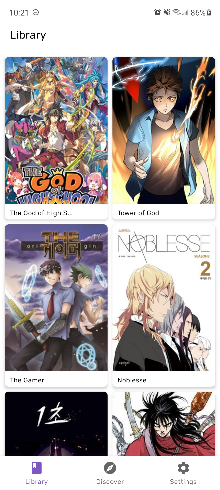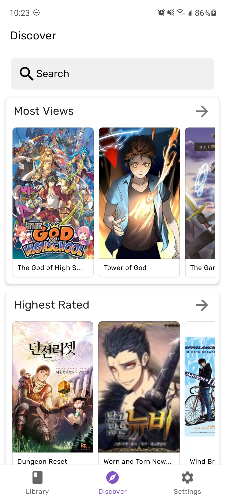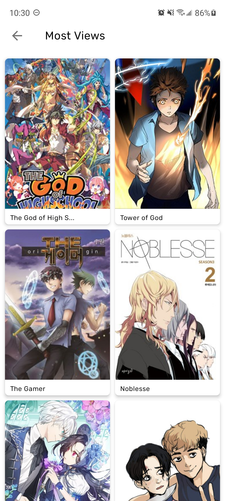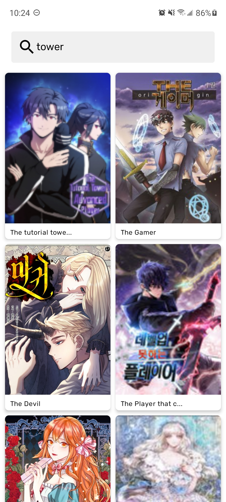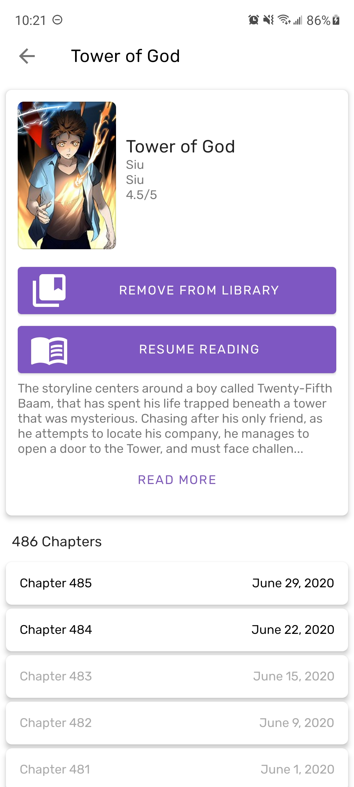
### Dark Mode Screenshots
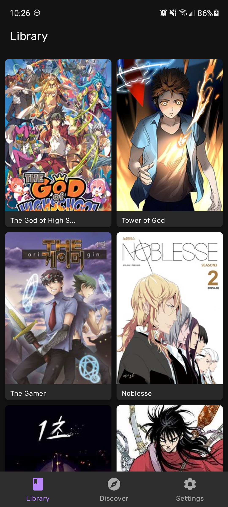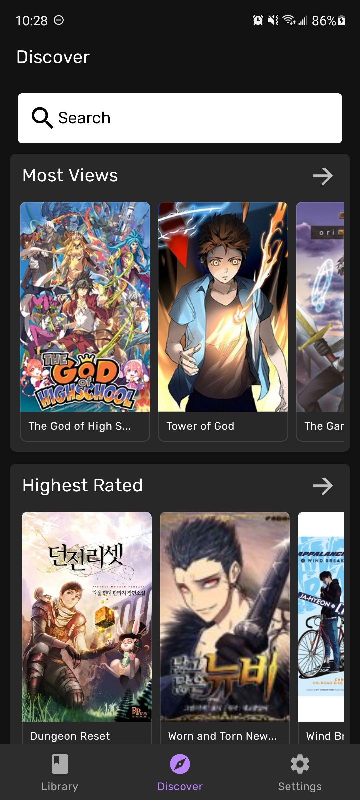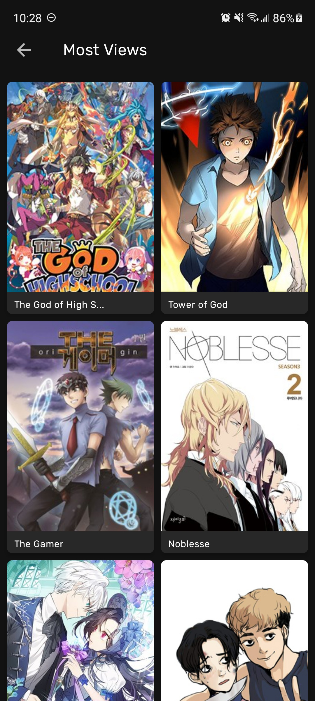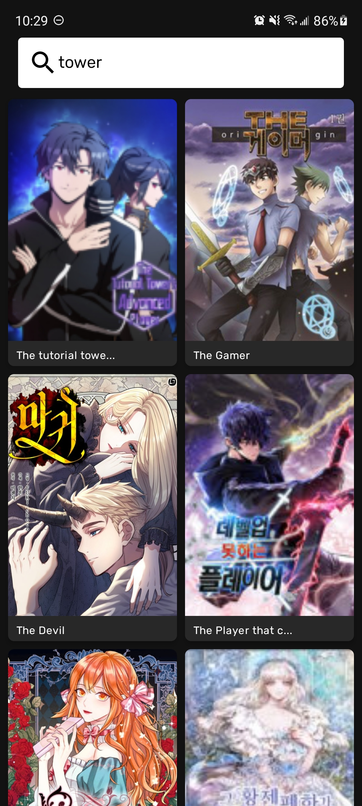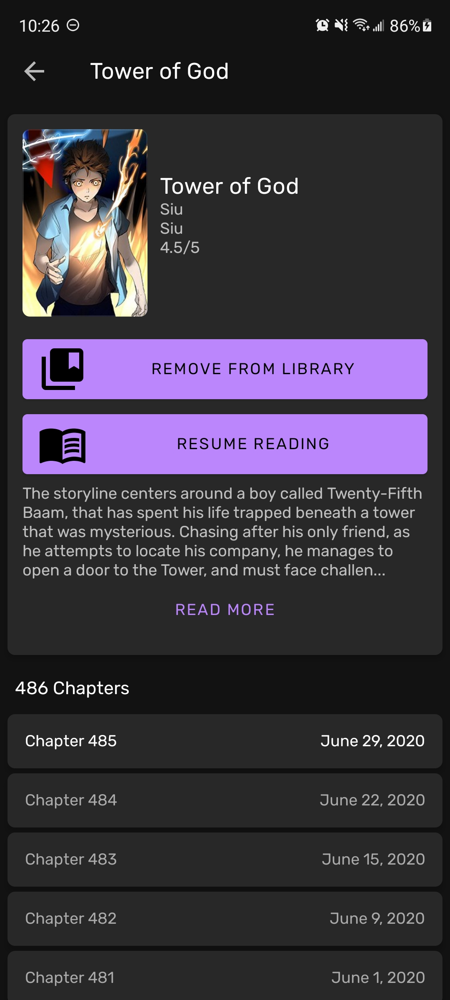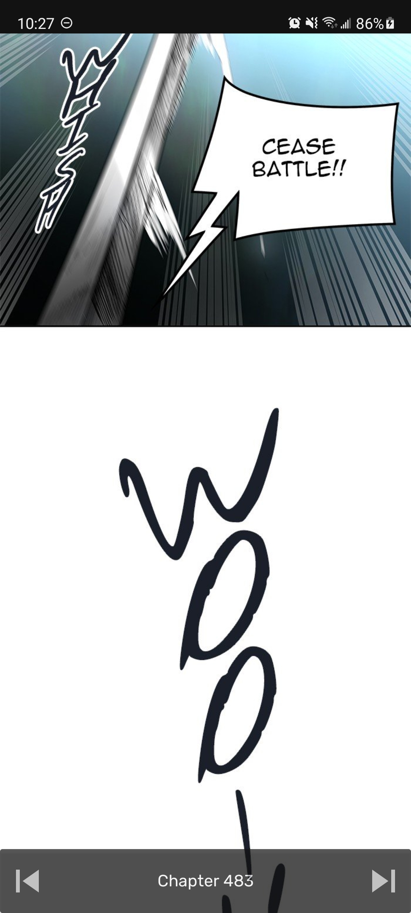
